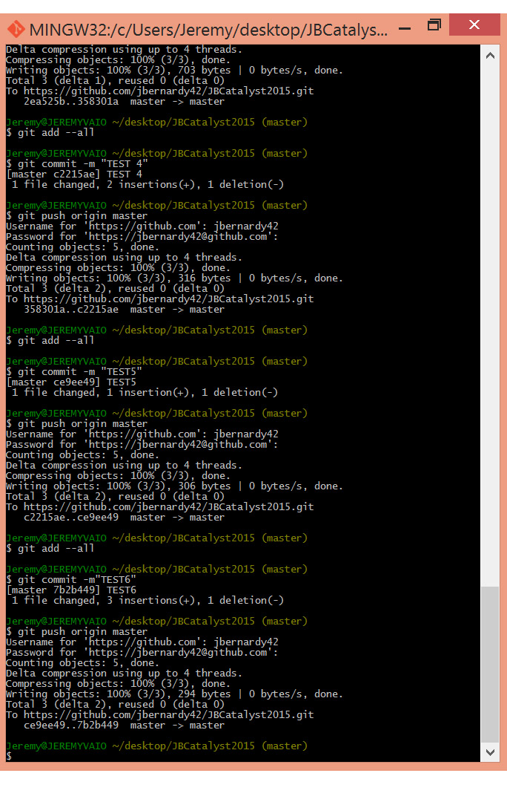

# Title
## Subtitle
### subsubtitle
####

Paragraph

List
* one
* two
* three

[LINK] (https//:www.umn.edu)

*Italics*

**Bold**

#Date 

#

Today git. Git today.

#CATALYST WORKSHOP (2015)

##Notes 3.9.2015

####Sample image for use

*TEST SCRIPT*

*ACTUAL NOTES*
 
**Problematic** - problems are generative

where on the spectrum is computer vision compelling?

1. *Instrumentalism*-Turn this into that. Get things done!
2. *Determinism* - Social or cultural change is done by technology
3. *Positivism* -  Social or cultural problems are solved through technology

###Project Notes

Photogrammetry

Building Photo Scan

**FOR TOMORROW**

9am---meet in lobby
By 10:30---2 rounds of photos---

1) one group repo (divide into sections)
2) round of individual repos

##Notes 3.10.15

####Initial thoughts on the program

1. Detail Hard
2. Reflection/sunlight are problems
3. consistency (in lighting) is important
4. distance matters (e.g framing)
5. Algorithm needs to know what you are trying to model
6. Warps are possible
7. Walk like a computer
8. Massing out a site
9. Using Google Earth data to generate a model
10. How to operate on these models
12. PhotoScan Models
13. Remodeling
14. Integrity of Building (maintain)
15. Mashup of models

*Object as a material*
*Where is computer vision compelling on a spectrum of speculation and representation?*

* Model the courtyard accurately (using photogrammetry)
* Past, present, future models
* The manual and the automated
* Expectations of representations
* values and memory associated with vision
* model as wrapper
* Interior ---Exterior
* Transparent architecture; openness not shaady corners

**Prompt**: How compelling is computer vision on a spectrum of speculation and representation.

*Practical Question*: what if we look at buildings as only meshes?

*Surface Types*: Stone, transparent glass, reflect glass, scupltural, flat, texture, natural, pattern text.

*Vision Effects*: New textures (from workflow), glitches, bubbles, stitches, deformed, warped, discreteness, pixels

**Record**:

1. Process for photography
2. Surface Types
3. Interior/exterior
4. Materials photographed
5. Push images to the repository
6. Note preprocessing techniques
7. Output model (OBJ, STL)

**Photographed Places**

STSS ~30'
* Equal step photography
* Exterior
* Brick, glass, metallic

Weisman Art Museum ~100'
* Equal step photo
* Exterior
* Brick, metal, panel shiny
* Curved form

Nils Hasselmo Hall
* Interior
* Panorama
* Open Atrium

Keller Hall ~50'
* Exterior
* Reflective Brick
* Panorama
* Tall Space

Amundson Hall Sculpture ~10'
* Exterior
* Walk around
* Patena Copper
* How an object is captured

**IMAGES FROM EXPLORATION**

Weisman Art Museum

Amundson Hall Copper Sculpture

STSS
 

##Notes 3.11.15

 Pillsbury Hall Archway and Rec Center photos
* Drone Session
* Entrances

* Make own stitch
* Decimate in Rhino
* Save as OBJ, Import Rhino, ReduceMesh Command
* 20-100faces

**IMAGES FROM EXPLORATION**

##Notes 3.12.15

-Why build a model?
*    Spectrum of representation and speculation
-What new insights into facades can CV tell us?
*    Practical vs. Conceptual
        * Enable the duplication of orientation
        * Blurring boundaries between Nature
        * Movement as form of space

**FOCUS**
* Transversal
* Affordance (of space)
* Blur and Equality
* Duplication (of ornamentation)
* What are the main ideas driving your work?
* How/what role does movement play in the process? To what extent are the models about movement? About vision?
* Collage in 3D? Attention to ornament?
* How to understand movement through space around you?
* Are we modelling affordances

**IMAGES FROM EXPLORATION**

**MY BOARDS**

Blur and Equality

Project: Video, model, process

* CV cannot distringuish between background and objects
* Humans can

*Blur* : 
* Vegetation
* Copper sculpture
* Pepper

*Equality* : CV does not have a bias towards background and foreground

As humans we perceive a direct focus whereas a computer is unbiased

Journal of sequence, human as computer

Different spots to test out

Boundaries and how materiality plays into it

##Notes 3.13.15

*Space*: Perception of humans vs perception of computer

Richness of environment 

*Our boards*

* Photoscans; Rhino untouched, Rhino ReduceMesh, combine in "NEW PATH"

* Plan view of path
* Buildings, trees (B+W)
* Path and camera (color)

Plan of path we took

Laser File for model

